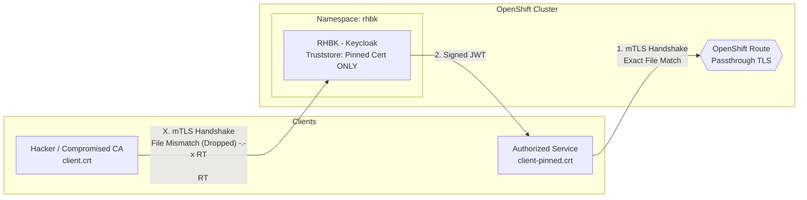

# End-to-End POC: Strict Certificate Pinning with RHBK and AWS API Gateway

## Overview

This documentation outlines an advanced variant of the Mutual TLS (mTLS) Proof of Concept (POC). While traditional mTLS relies on a Certificate Authority (CA) to establish trust, this variant utilizes **Strict Certificate Pinning**.

In this architecture, Red Hat Build of Keycloak (RHBK) is configured to **ignore any CA** and only trust a specific, physically "pinned" client certificate file. This guarantees absolute network isolation: even if an attacker compromises your internal CA and clones the Common Name (CN), they will be blocked at the TCP/TLS layer.

---

## Architecture

- **Identity Provider:** A dedicated Red Hat Build of Keycloak (RHBK) instance deployed via Operator on OpenShift. It uses a Passthrough Route to directly terminate TLS.
- **Trust Model:** The RHBK Truststore contains **only** the `client-pinned.crt` file. No CA root certificates are included.
- **Client Provisioning:** The client is registered using Dynamic Client Registration (DCR) conforming to OIDC [RFC 7591](https://datatracker.ietf.org/doc/html/rfc7591).
- **API Gateway:** AWS API Gateway (HTTP API) configured with a JWT Authorizer.



---

## Phase 1: Cryptography & Database Isolation

To prevent cross-contamination with existing configurations, we deploy a completely isolated database and generate fresh, self-signed cryptography.

### 1. Create the Pinned Certificate and Truststore

We bypass the Certificate Authority entirely. Run these commands locally in a new folder:

```bash
# 1. Generate a self-signed certificate and private key for the pinned client
openssl req -x509 -newkey rsa:2048 -nodes \
  -keyout client-pinned.key \
  -out client-pinned.crt \
  -days 365 \
  -subj "/CN=aws-api-client-pinned"

# 2. Import ONLY this specific certificate into a new truststore (No CA!)
keytool -import -alias pinned-client-cert \
  -file client-pinned.crt \
  -keystore truststore-pinned.jks \
  -storepass changeit \
  -noprompt
```

### 2. Deploy a Dedicated Database

Create a completely separate PostgreSQL pod named `postgresql-db-pinned`.

```bash
# Create the Database Secret
oc create secret generic keycloak-db-pinned-secret \
  --from-literal=username=keycloak \
  --from-literal=password=keycloak \
  -n rhbk
```

Apply the Database Deployment (`db-pinned.yaml`):

```yaml
apiVersion: apps/v1
kind: StatefulSet
metadata:
  name: postgresql-db-pinned
  namespace: rhbk
spec:
  serviceName: postgres-db-pinned
  selector:
    matchLabels:
      app: postgresql-db-pinned
  replicas: 1
  template:
    metadata:
      labels:
        app: postgresql-db-pinned
    spec:
      containers:
        - name: postgresql-db
          image: postgres:latest
          volumeMounts:
            - mountPath: /data
              name: cache-volume
          env:
            - name: POSTGRES_PASSWORD
              value: keycloak
            - name: POSTGRES_USER
              value: keycloak
            - name: PGDATA
              value: /data/pgdata
            - name: POSTGRES_DB
              value: keycloak
      volumes:
        - name: cache-volume
          emptyDir: {}
---
apiVersion: v1
kind: Service
metadata:
  name: postgres-db-pinned
  namespace: rhbk
spec:
  selector:
    app: postgresql-db-pinned
  type: ClusterIP
  ports:
    - port: 5432
      targetPort: 5432
```

```bash
oc apply -f db-pinned.yaml -n rhbk
```

---

## Phase 2: Deploy the Isolated RHBK Instance

### 1. Create the Kubernetes Truststore Secrets

```bash
# Upload the pinned truststore
oc create secret generic truststore-file-pinned-secret \
  --from-file=truststore.jks=truststore-pinned.jks \
  -n rhbk

# Create the configuration secret for the path/password
oc create secret generic truststore-pinned-secret \
  --from-literal=password=changeit \
  --from-literal=path=/opt/truststore/truststore.jks \
  -n rhbk
```

### 2. Configure and Apply the RHBK Custom Resource

Apply the Keycloak CR (`rhbk-pinned.yaml`):

```yaml
apiVersion: k8s.keycloak.org/v2alpha1
kind: Keycloak
metadata:
  name: rhbk-pinned-instance
  namespace: rhbk
spec:
  instances: 1
  db:
    vendor: postgres
    host: postgres-db-pinned
    usernameSecret:
      name: keycloak-db-pinned-secret
      key: username
    passwordSecret:
      name: keycloak-db-pinned-secret
      key: password
  hostname:
    hostname: <YOUR_RHBK_HOSTNAME>
    strict: true
  http:
    tlsSecret: rhbk-tls-poc-secret

  # Inject the Pinned Truststore
  unsupported:
    podTemplate:
      spec:
        containers:
          - volumeMounts:
              - mountPath: /opt/truststore
                name: truststore
        volumes:
          - name: truststore
            secret:
              secretName: truststore-file-pinned-secret

  additionalOptions:
    - name: https-client-auth
      value: request
    - name: https-trust-store-file
      secret:
        name: truststore-pinned-secret
        key: path
    - name: https-trust-store-password
      secret:
        name: truststore-pinned-secret
        key: password
```

```bash
oc apply -f rhbk-pinned.yaml -n rhbk
```

### 3. Enforce Passthrough Routing

Patch the newly created route to ensure the mTLS handshake passes through the OpenShift router directly to RHBK.

```bash
oc patch route rhbk-pinned-instance -n rhbk \
  -p '{"spec":{"tls":{"termination":"passthrough"}}}'
```

---

## Phase 3: Dynamic Client Registration (DCR)

1. Extract your new Keycloak admin credentials:

   ```bash
   oc extract secret/rhbk-pinned-instance-initial-admin --to=- -n rhbk
   ```

2. Log into the RHBK Admin Console and create a new realm named `aws-pinned-realm`.

3. Generate an **Initial Access Token (IAT)** from **Realm Settings > Client Registration**.

4. Execute DCR to dynamically register the client:

   ```bash
   curl -X POST \
     https://<YOUR_RHBK_HOSTNAME>/realms/aws-pinned-realm/clients-registrations/openid-connect \
     -H "Content-Type: application/json" \
     -H "Authorization: Bearer <YOUR_IAT_TOKEN>" \
     -d '{
       "client_name": "Dynamically Registered Pinned Client",
       "token_endpoint_auth_method": "tls_client_auth",
       "grant_types": ["client_credentials"],
       "tls_client_auth_subject_dn": "CN=aws-api-client-pinned",
       "tls_client_certificate_bound_access_tokens": true
     }'
   ```

   > The `tls_client_certificate_bound_access_tokens` field enables **OAuth 2.0 Mutual TLS Certificate Bound Access Tokens** ([RFC 8705 Section 3](https://datatracker.ietf.org/doc/html/rfc8705#section-3)). When enabled, every access token issued to this client will contain a `cnf` (confirmation) claim with the certificate's SHA-256 thumbprint (`x5t#S256`). A resource server can then verify that the token presenter holds the same certificate — a stolen token is useless without the matching private key.
   >
   > If registering the client manually via the Admin Console instead of DCR, navigate to the client's **Advanced** tab -> **Advanced settings** -> set **OAuth 2.0 Mutual TLS Certificate Bound Access Tokens Enabled** to **ON**.

> **Note:** Save the `client_id` (UUID) returned in the JSON response.

---

## Phase 4: The Validation Demo

This side-by-side validation proves that identity (CN) alone is insufficient; the network layer demands the exact cryptographic file.

### Test 1: The Hacker / Compromised CA Test (EXPECTED FAILURE)

Attempt to request a token using a standard, CA-signed certificate (`client.crt`) that has a valid format but is **not** the specific file pinned in the truststore.

```bash
curl -v -s -X POST \
  'https://<YOUR_RHBK_HOSTNAME>/realms/aws-pinned-realm/protocol/openid-connect/token' \
  --cert client.crt \
  --key client.key \
  -H "Content-Type: application/x-www-form-urlencoded" \
  -d "client_id=<YOUR_DCR_CLIENT_ID>" \
  -d "grant_type=client_credentials"
```

**Result:**

```
curl: (56) LibreSSL SSL_read: error:1404C416:SSL routines:ST_OK:sslv3 alert certificate unknown
```

**Conclusion:** Connection instantly terminated at Layer 4.

---

### Test 2: The Happy Path (EXPECTED SUCCESS)

Execute the exact same request, but present the physically pinned certificate (`client-pinned.crt`).

```bash
curl -s -X POST \
  'https://<YOUR_RHBK_HOSTNAME>/realms/aws-pinned-realm/protocol/openid-connect/token' \
  --cert client-pinned.crt \
  --key client-pinned.key \
  -H "Content-Type: application/x-www-form-urlencoded" \
  -d "client_id=<YOUR_DCR_CLIENT_ID>" \
  -d "grant_type=client_credentials"
```

**Result:**

```json
{
  "access_token": "eyJhbGciOiJSUzI1NiIs...",
  "expires_in": 300,
  "token_type": "Bearer"
}
```

**Conclusion:** The TLS passthrough router recognizes the exact certificate thumbprint, establishes the secure tunnel, and Keycloak successfully issues the JWT.

---

## Architectural Trade-Offs

| Pros | Cons |
| :--- | :--- |
| **Maximum Security:** Irrefutable protection against compromised internal Certificate Authorities. A rogue admin issuing a validly-named certificate cannot bypass this. | **Loss of Zero-Touch Rotation:** When the client's certificate expires, the OpenShift Administrator must manually update the RHBK Kubernetes Secret with the new `.crt` file and restart the pods. |
