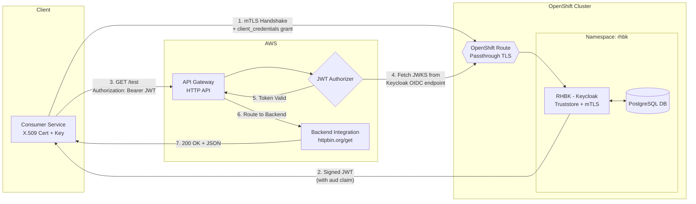

# End-to-End POC: Securing AWS API Gateway with RHBK via mTLS Client Authentication (`tls_client_auth`)

This repository contains the documentation and steps for a hybrid-cloud Proof of Concept (POC). It demonstrates how to secure an AWS API Gateway (HTTP API) using JSON Web Tokens (JWT) issued by a **Red Hat Build of Keycloak (RHBK)** instance hosted on OpenShift.

By utilizing **Mutual TLS (mTLS) Client Authentication** (`tls_client_auth`), this architecture replaces traditional shared secrets (`client_secret`) with a robust, cryptography-based authentication flow for **Machine-to-Machine (M2M)** communication, fully complying with [RFC 8705](https://datatracker.ietf.org/doc/html/rfc8705).

---

## Architecture Overview

This POC uses the **OAuth 2.0 Client Credentials Grant**, bound by mTLS.

- **Identity Provider:** Red Hat Build of Keycloak (RHBK) deployed via Operator on OpenShift. It uses a **Passthrough Route** to directly terminate TLS and validate client certificates.
- **Client / Consumer Service:** Uses an X.509 Certificate and Private Key to authenticate with RHBK.
- **API Gateway:** AWS API Gateway (HTTP API) configured with a JWT Authorizer.
- **Backend API:** `httpbin.org/get` acting as a mock backend to verify successful routing.

### Architecture Diagram



### Request Flow

| Step | Description |
|------|-------------|
| 1 | Client initiates a TLS handshake with RHBK, presenting its **X.509 Client Certificate**. |
| 2 | Client requests an access token using the `client_credentials` grant. **No client secret is sent.** |
| 3 | RHBK validates the certificate's trust against its Truststore and verifies the **Subject DN**. |
| 4 | RHBK returns a signed JWT containing the required `aud` (audience) claim. |
| 5 | Client calls AWS API Gateway, passing the JWT in the `Authorization: Bearer` header. |
| 6 | AWS JWT Authorizer fetches the **JWKS** (public keys) from Keycloak to validate the token signature. |
| 7 | On success, API Gateway routes the request to the backend integration (httpbin). |

---

## Prerequisites

- An OpenShift cluster (e.g., OpenTLC Sandbox) with cluster-admin privileges.
- An AWS Account with permissions to create API Gateways.
- The `oc`, `curl`, `openssl`, and `keytool` CLI tools installed locally.
- The `rhbk` namespace already created on your cluster.

---

## Step 0: Prepare Certificates

To satisfy AWS API Gateway's strict requirement for publicly trusted Issuer URLs, RHBK must serve a **valid public certificate**. Simultaneously, we need a **private CA** for our client certificates.

### 1. Extract the valid OpenShift Wildcard Certificate (For the RHBK Server)

```bash
# Extracts the valid OpenTLC router certs to your local directory
oc extract secret/router-certs-default -n openshift-ingress --keys=tls.crt,tls.key --to=.
```

### 2. Create a local Certificate Authority (CA) for Client Auth

```bash
openssl req -new -x509 -days 3650 -keyout ca.key -out ca.crt -subj "/CN=POC-CA" -nodes
```

### 3. Create the Client Certificate for your Consumer Service

```bash
openssl req -newkey rsa:2048 -nodes -keyout client.key -out client.csr -subj "/CN=aws-api-client"
openssl x509 -req -in client.csr -CA ca.crt -CAkey ca.key -CAcreateserial -out client.crt -days 365
```

### 4. Create a Java Keystore (Truststore) containing the CA

This allows RHBK to trust the client certificate.

```bash
keytool -import -alias poc-ca -file ca.crt -keystore truststore.jks -storepass changeit -noprompt
```

---

## Step 1: Deploy the Database

Deploy a dedicated PostgreSQL instance in the `rhbk` namespace to prevent conflicts with other Keycloak instances.

```yaml
apiVersion: apps/v1
kind: StatefulSet
metadata:
  name: postgresql-db-poc
  namespace: rhbk
spec:
  serviceName: postgres-db-poc
  selector:
    matchLabels:
      app: postgresql-db-poc
  replicas: 1
  template:
    metadata:
      labels:
        app: postgresql-db-poc
    spec:
      containers:
        - name: postgresql-db
          image: postgres:latest
          volumeMounts:
            - mountPath: /data
              name: cache-volume
          env:
            - name: POSTGRES_PASSWORD
              value: keycloak
            - name: POSTGRES_USER
              value: keycloak
            - name: PGDATA
              value: /data/pgdata
            - name: POSTGRES_DB
              value: keycloak
      volumes:
        - name: cache-volume
          emptyDir: {}
---
apiVersion: v1
kind: Service
metadata:
  name: postgres-db-poc
  namespace: rhbk
spec:
  selector:
    app: postgresql-db-poc
  type: ClusterIP
  ports:
    - port: 5432
      targetPort: 5432
```

Create the database credentials secret:

```bash
oc create secret generic keycloak-db-poc-secret \
  --from-literal=username=keycloak \
  --from-literal=password=keycloak \
  -n rhbk
```

---

## Step 2: Deploy RHBK Configured for mTLS

Following [Red Hat KCS 7057715](https://access.redhat.com/solutions/7057715), we securely mount the truststore using Kubernetes Secrets and the `podTemplate`.

### 1. Create Kubernetes Secrets for Certificates and Truststore

```bash
# Upload the valid OpenTLC Server Certs
oc create secret tls rhbk-tls-poc-secret --cert=tls.crt --key=tls.key -n rhbk

# Upload the Truststore file
oc create secret generic truststore-file-poc-secret --from-file=truststore.jks -n rhbk

# Create the configuration secret for the Truststore path/password
oc create secret generic truststore-poc-secret \
  --from-literal=password=changeit \
  --from-literal=path=/opt/truststore/truststore.jks \
  -n rhbk
```

### 2. Deploy the Keycloak CR

```yaml
apiVersion: k8s.keycloak.org/v2alpha1
kind: Keycloak
metadata:
  name: rhbk-poc-instance
  namespace: rhbk
spec:
  instances: 1
  db:
    vendor: postgres
    host: postgres-db-poc
    usernameSecret:
      name: keycloak-db-poc-secret
      key: username
    passwordSecret:
      name: keycloak-db-poc-secret
      key: password
  hostname:
    hostname: <YOUR_OPENSHIFT_ROUTE_URL>  # e.g., rhbk.apps...opentlc.com
    strict: true
  http:
    tlsSecret: rhbk-tls-poc-secret

  # Inject the Truststore via podTemplate
  unsupported:
    podTemplate:
      spec:
        containers:
          - volumeMounts:
              - mountPath: /opt/truststore
                name: truststore
        volumes:
          - name: truststore
            secret:
              secretName: truststore-file-poc-secret

  additionalOptions:
    - name: https-client-auth
      value: request
    - name: https-trust-store-file
      secret:
        name: truststore-poc-secret
        key: path
    - name: https-trust-store-password
      secret:
        name: truststore-poc-secret
        key: password
```

### 3. Configure OpenShift Route

Patch the route to **Passthrough** so the client certificate reaches Keycloak intact.

```bash
oc patch route <YOUR_ROUTE_NAME> -n rhbk -p '{"spec":{"tls":{"termination":"passthrough"}}}'
```

### Get Admin Credentials

```bash
oc extract secret/rhbk-poc-instance-initial-admin --to=- -n rhbk
```

---

## Step 3: Configure Keycloak Client for X.509

1. Log into the **Keycloak Admin Console**.

2. **Create a Realm:** Name it `aws-poc-realm`.

3. **Create a Client:**
   - **Client ID:** `aws-api-client`
   - **Client authentication:** ON
   - **Service accounts roles:** ON

4. **Configure `tls_client_auth`:**
   - Navigate to the client's **Credentials** tab.
   - Set **Client Authenticator** to `X509 Certificate`.
   - **Subject DN:** `CN=aws-api-client`

5. **Create the Audience Mapper** (Critical for AWS API Gateway Validation):
   - Go to the **Client scopes** tab -> Click `aws-api-client-dedicated`.
   - Click **Add mapper > Configure a new mapper > Audience**.
   - **Name:** `aws-audience-mapper`
   - **Included Client Audience:** `aws-api-client`
   - **Add to access token:** ON -> **Save**.

---

## Step 4: Configure AWS API Gateway

1. Log into the **AWS Console** -> **API Gateway** -> **Create HTTP API**.

2. **Integrations:** Add HTTP `GET` integration pointing to `https://httpbin.org/get`.

3. **Routes:** Create a `GET /test` route and attach the integration.

4. **Attach JWT Authorizer:**
   - **Type:** JWT
   - **Identity source:** `$request.header.Authorization`
   - **Issuer URL:** `https://<YOUR_OPENSHIFT_ROUTE_URL>/realms/aws-poc-realm`
     > **Warning:** No trailing slash!
   - **Audience:** `aws-api-client`
   - Click **Create and attach**, then copy your **Invoke URL**.

---

## Step 5: End-to-End Validation

### Test 1: Fetch Token from RHBK using mTLS

Pass the client certificate directly in the `curl` TLS handshake (no `client_secret` used):

```bash
curl -s -X POST 'https://<YOUR_OPENSHIFT_ROUTE_URL>/realms/aws-poc-realm/protocol/openid-connect/token' \
  --cert client.crt \
  --key client.key \
  -H "Content-Type: application/x-www-form-urlencoded" \
  -d "client_id=aws-api-client" \
  -d "grant_type=client_credentials"
```

Copy the resulting `"access_token"` string.

### Test 2: Access API Gateway Successfully

Pass the generated JWT as a Bearer token to AWS:

```bash
curl -i -H "Authorization: Bearer <PASTE_YOUR_ACCESS_TOKEN_HERE>" https://<YOUR_AWS_INVOKE_URL>/test
```

**Expected Result:** `HTTP/1.1 200 OK` from the httpbin backend. This confirms AWS successfully fetched the JWKS via the public certificate, validated the token signature, matched the `aud` claim, and routed the traffic to the backend.

---

## Implementation Notes for Production

- **Token Automation:** In production, backend services will use standard HTTP interceptor libraries (e.g., Spring Security, Python `requests-oauthlib`) to automatically cache, inject, and refresh tokens before making calls to AWS.

- **Databases:** This POC uses an `emptyDir` volume for PostgreSQL. For production, replace it with a PersistentVolumeClaim (PVC) or use a managed database service (e.g., AWS RDS) for data durability.

- **Certificate Rotation:** Implement automated certificate rotation using tools like cert-manager to ensure client certificates are renewed before expiry.

- **mTLS vs. Client Secret:** The `tls_client_auth` method eliminates the risk of secret leakage in logs, environment variables, or configuration files. The private key never leaves the client, making this approach significantly more secure for M2M workloads.
