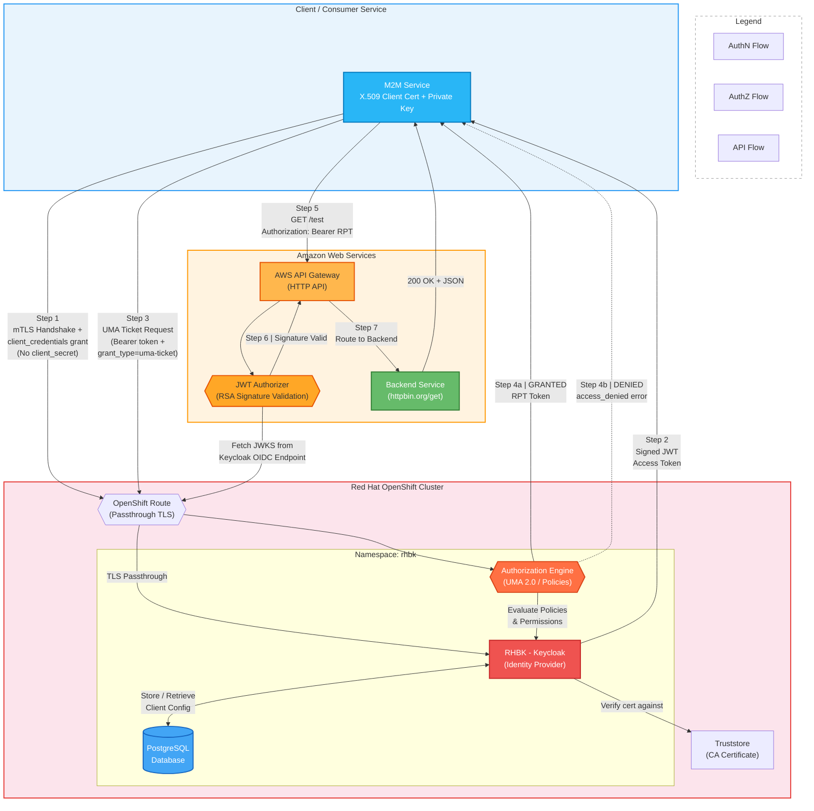
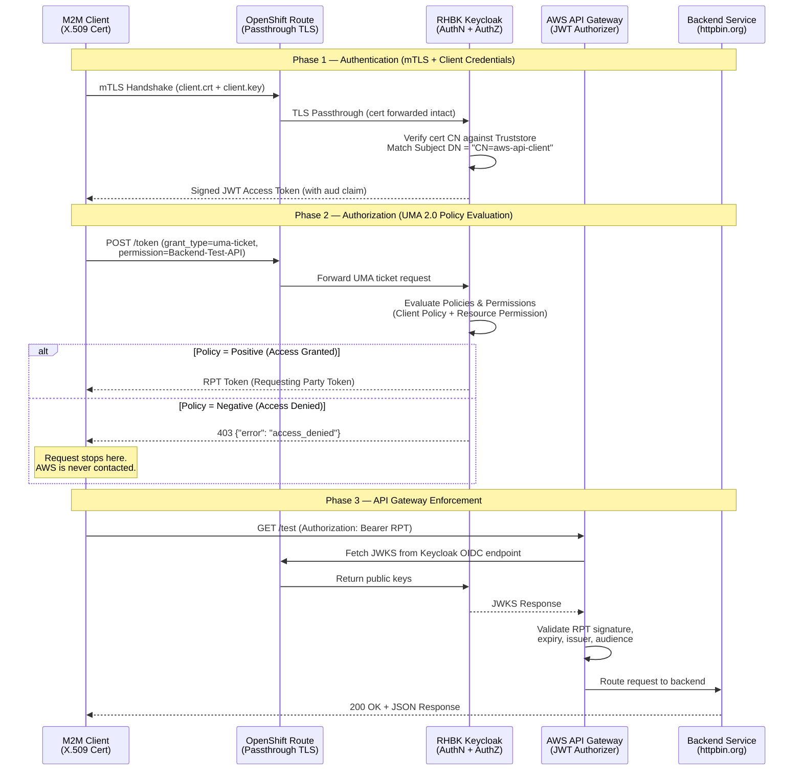
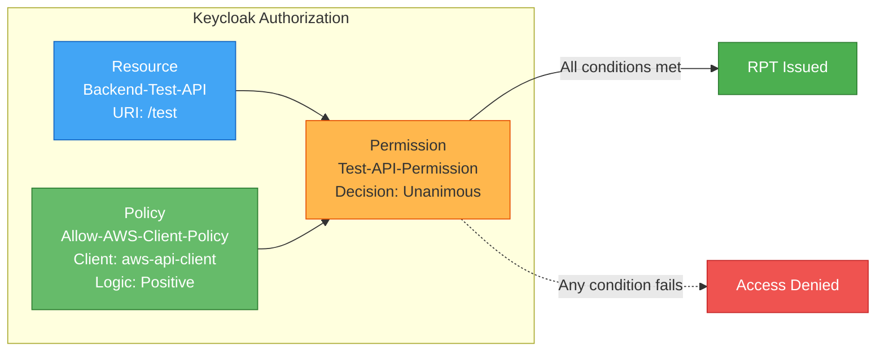
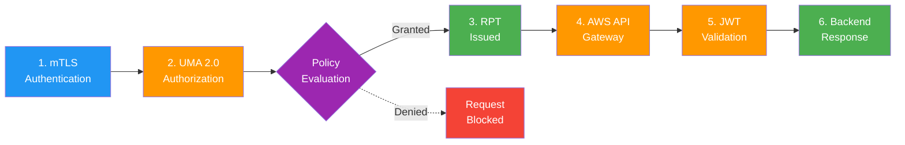

# Enterprise M2M Zero-Trust Architecture: Centralized Authentication & Authorization

> **Red Hat Build of Keycloak (RHBK) + AWS API Gateway | mTLS + UMA 2.0**

This Proof of Concept demonstrates a financial-grade **Zero-Trust architecture** for Machine-to-Machine (M2M) communication. Red Hat Build of Keycloak (RHBK) acts as the centralized brain for both **Identity and Access Management**, while AWS API Gateway acts as the policy enforcer.

---

## Architecture Diagram



### Sequence Diagram



---

## Key Architectural Pillars

| Pillar | Mechanism | Benefit |
|--------|-----------|---------|
| **Authentication** | Mutual TLS (`tls_client_auth`) | Replaces vulnerable shared passwords (`client_secret`) with transport-layer cryptographic proof using X.509 certificates. Certificate-bound access tokens (`cnf` / `x5t#S256`) prevent token theft and replay. Compliant with [RFC 8705](https://datatracker.ietf.org/doc/html/rfc8705). |
| **Centralized Authorization** | UMA 2.0 (User-Managed Access) | Access rules are removed from backend code and API Gateways. Keycloak centrally manages policies and issues a Requesting Party Token (RPT) only if all security conditions are met. |
| **Decoupled Enforcement** | JWT Signature Validation | AWS API Gateway simply validates the RPT signature. If Keycloak denies authorization, the request never reaches the AWS cloud. |

### Why This Matters

```
Traditional Approach:
  Client --> Secret in HTTP Body --> Server --> Gateway --> Backend
                    ^
                    |
        Secrets in logs, env vars, shell history, proxy traces

Zero-Trust Approach (This POC):
  Client --> mTLS Handshake (private key never leaves client)
         --> Policy Engine evaluates authorization centrally
         --> RPT issued only if policies pass
         --> Gateway validates cryptographic signature only
                    ^
                    |
        No secrets in transit. No security logic in gateway.
```

---

## Prerequisites

| Requirement | Details |
|-------------|---------|
| OpenShift Cluster | With `cluster-admin` privileges |
| Namespace | `rhbk` namespace created on your cluster |
| AWS Account | Permissions to create an HTTP API Gateway |
| Local Tools | `oc`, `curl`, `openssl`, `keytool`, `jq` |

---

## Step 1: Prepare mTLS Cryptography

We must establish a Certificate Authority (CA) and generate the client's secure key pair.

### 1.1 Extract valid OpenShift Wildcard Certificate (for the RHBK server route)

```bash
oc extract secret/router-certs-default -n openshift-ingress --keys=tls.crt,tls.key --to=.
```

### 1.2 Create a local Certificate Authority (CA) for client auth

```bash
openssl req -new -x509 -days 3650 -keyout ca.key -out ca.crt -subj "/CN=POC-CA" -nodes
```

### 1.3 Create the client certificate for your consumer service

```bash
openssl req -newkey rsa:2048 -nodes -keyout client.key -out client.csr -subj "/CN=aws-api-client"
openssl x509 -req -in client.csr -CA ca.crt -CAkey ca.key -CAcreateserial -out client.crt -days 365
```

### 1.4 Create a Java Keystore (Truststore) containing the CA

```bash
keytool -import -alias poc-ca -file ca.crt -keystore truststore.jks -storepass changeit -noprompt
```

**Certificate chain summary:**

```
POC-CA (ca.crt / ca.key)          <-- Root of trust (loaded into RHBK truststore)
  └── aws-api-client (client.crt)  <-- Presented by client during mTLS handshake
        Subject DN: CN=aws-api-client
```

---

## Step 2: Deploy Database & RHBK on OpenShift

### 2A. Upload Secrets to OpenShift

```bash
# Database credentials
oc create secret generic keycloak-db-poc-secret \
  --from-literal=username=keycloak \
  --from-literal=password=keycloak \
  -n rhbk

# Server TLS certificate (valid OpenShift wildcard cert)
oc create secret tls rhbk-tls-poc-secret \
  --cert=tls.crt \
  --key=tls.key \
  -n rhbk

# Truststore file (contains the CA that signed the client cert)
oc create secret generic truststore-file-poc-secret \
  --from-file=truststore.jks \
  -n rhbk

# Truststore configuration (path and password)
oc create secret generic truststore-poc-secret \
  --from-literal=password=changeit \
  --from-literal=path=/opt/truststore/truststore.jks \
  -n rhbk
```

### 2B. Deploy PostgreSQL Database

```yaml
apiVersion: apps/v1
kind: StatefulSet
metadata:
  name: postgresql-db-poc
  namespace: rhbk
spec:
  serviceName: postgres-db-poc
  selector:
    matchLabels:
      app: postgresql-db-poc
  replicas: 1
  template:
    metadata:
      labels:
        app: postgresql-db-poc
    spec:
      containers:
        - name: postgresql-db
          image: postgres:latest
          volumeMounts:
            - mountPath: /data
              name: cache-volume
          env:
            - name: POSTGRES_PASSWORD
              value: keycloak
            - name: POSTGRES_USER
              value: keycloak
            - name: PGDATA
              value: /data/pgdata
            - name: POSTGRES_DB
              value: keycloak
      volumes:
        - name: cache-volume
          emptyDir: {}
---
apiVersion: v1
kind: Service
metadata:
  name: postgres-db-poc
  namespace: rhbk
spec:
  selector:
    app: postgresql-db-poc
  type: ClusterIP
  ports:
    - port: 5432
      targetPort: 5432
```

### 2C. Deploy RHBK Configured for mTLS

Following [Red Hat KCS 7057715](https://access.redhat.com/solutions/7057715), the truststore is mounted using `podTemplate`.

```yaml
apiVersion: k8s.keycloak.org/v2alpha1
kind: Keycloak
metadata:
  name: rhbk-poc-instance
  namespace: rhbk
spec:
  instances: 1
  db:
    vendor: postgres
    host: postgres-db-poc
    usernameSecret:
      name: keycloak-db-poc-secret
      key: username
    passwordSecret:
      name: keycloak-db-poc-secret
      key: password
  hostname:
    hostname: <YOUR_OPENSHIFT_ROUTE_URL>
    strict: true
  http:
    tlsSecret: rhbk-tls-poc-secret

  unsupported:
    podTemplate:
      spec:
        containers:
          - volumeMounts:
              - mountPath: /opt/truststore
                name: truststore
        volumes:
          - name: truststore
            secret:
              secretName: truststore-file-poc-secret

  additionalOptions:
    - name: https-client-auth
      value: request
    - name: https-trust-store-file
      secret:
        name: truststore-poc-secret
        key: path
    - name: https-trust-store-password
      secret:
        name: truststore-poc-secret
        key: password
```

### 2D. Patch the OpenShift Route for mTLS Passthrough

```bash
oc patch route <YOUR_ROUTE_NAME> -n rhbk \
  -p '{"spec":{"tls":{"termination":"passthrough"}}}'
```

### 2E. Retrieve Admin Credentials

```bash
oc extract secret/rhbk-poc-instance-initial-admin --to=- -n rhbk
```

---

## Step 3: Configure Keycloak (Authentication & Authorization)

Log into the Keycloak Admin Console and create a realm named `aws-poc-realm`.

### Phase A: Setup Client Authentication (mTLS)

**1. Create the Client**

Navigate to **Clients** -> **Create client**:

| Setting | Value |
|---------|-------|
| Client ID | `aws-api-client` |

Under **Capability config**:

| Setting | Value |
|---------|-------|
| Client authentication | **ON** |
| Authorization | **ON** |

> Enabling Authorization automatically enables **Service accounts roles**.

**2. Configure X.509 Certificate Authentication**

Navigate to the **Credentials** tab:

| Setting | Value |
|---------|-------|
| Client Authenticator | `X509 Certificate` |
| Subject DN | `CN=aws-api-client` |

**3. Enable Certificate-Bound Access Tokens**

Navigate to the **Advanced** tab -> scroll to **Advanced settings**:

| Setting | Value |
|---------|-------|
| OAuth 2.0 Mutual TLS Certificate Bound Access Tokens Enabled | **ON** |

Click **Save**.

> This binds each access token to the client's TLS certificate by embedding the certificate's SHA-256 thumbprint (`x5t#S256`) in the token's `cnf` (confirmation) claim, as defined in [RFC 8705 Section 3](https://datatracker.ietf.org/doc/html/rfc8705#section-3). Resource servers can then verify that the entity presenting the token is the same entity that authenticated — a stolen token cannot be replayed from a different client without the corresponding private key.

**4. Create the Audience Mapper**

Navigate to **Client scopes** -> `aws-api-client-dedicated`:

Click **Add mapper** -> **Configure a new mapper** -> **Audience**:

| Setting | Value |
|---------|-------|
| Name | `aws-audience` |
| Included Client Audience | `aws-api-client` |
| Add to access token | **ON** |

Click **Save**.

---

### Phase B: Setup Centralized Authorization (UMA 2.0)

After enabling Authorization in Phase A, the **Authorization** tab appears in your client settings.

**1. Create the Resource**

Navigate to **Authorization** -> **Resources** -> **Create resource**:

| Setting | Value |
|---------|-------|
| Name | `Backend-Test-API` |
| URIs | `/test` |

Click **Save**.

**2. Create the Policy**

Navigate to **Authorization** -> **Policies** -> **Create policy** -> **Client**:

| Setting | Value |
|---------|-------|
| Name | `Allow-AWS-Client-Policy` |
| Clients | `aws-api-client` |
| Logic | **Positive** |

> **CRITICAL:** Click the empty input box next to **Clients**, type and select `aws-api-client` so it appears as a selected bubble/chip. If you skip this, the policy has no client associated and authorization will fail with `access_denied`.

Click **Save**.

**3. Create the Permission**

Navigate to **Authorization** -> **Permissions** -> **Create permission** -> **Resource-based**:

| Setting | Value |
|---------|-------|
| Name | `Test-API-Permission` |
| Resources | `Backend-Test-API` |
| Policies | `Allow-AWS-Client-Policy` |
| Decision Strategy | **Unanimous** |

> **CRITICAL:** You must click the empty input boxes and select both the Resource and Policy so they appear as selected chips. If either is missing, the permission will not evaluate correctly.

Click **Save**.

---

**Authorization Configuration Summary:**



---

## Step 4: Configure AWS API Gateway

1. Log into **AWS Console** -> **API Gateway** -> **Create HTTP API**.

2. **Integrations:** Add HTTP `GET` integration pointing to `https://httpbin.org/get`.

3. **Routes:** Create a `GET /test` route and attach the integration.

4. **Attach JWT Authorizer:**

| Setting | Value |
|---------|-------|
| Type | JWT |
| Identity source | `$request.header.Authorization` |
| Issuer URL | `https://<YOUR_OPENSHIFT_ROUTE_URL>/realms/aws-poc-realm` |
| Audience | `aws-api-client` |

> **Warning:** Do NOT include a trailing slash in the Issuer URL.

5. Copy your **Invoke URL** from the API overview page.

---

## Step 5: Customer Demo Execution

> "We will now authenticate securely via Mutual TLS, ask Keycloak's centralized policy engine for an authorization token (RPT), and use it to access the AWS API Gateway."

### Demo 1: The Happy Path (Access Granted)

**Step 1 -- Authenticate (Get access token via mTLS)**

```bash
export ACCESS_TOKEN=$(curl -s -X POST \
  'https://<YOUR_OPENSHIFT_ROUTE_URL>/realms/aws-poc-realm/protocol/openid-connect/token' \
  --cert client.crt \
  --key client.key \
  -H "Content-Type: application/x-www-form-urlencoded" \
  -d "client_id=aws-api-client" \
  -d "grant_type=client_credentials" | jq -r .access_token)
```

**Step 2 -- Authorize (Ask Keycloak to evaluate policies and issue an RPT)**

```bash
export RPT_TOKEN=$(curl -s -X POST \
  'https://<YOUR_OPENSHIFT_ROUTE_URL>/realms/aws-poc-realm/protocol/openid-connect/token' \
  --cert client.crt \
  --key client.key \
  -H "Authorization: Bearer $ACCESS_TOKEN" \
  -H "Content-Type: application/x-www-form-urlencoded" \
  -d "grant_type=urn:ietf:params:oauth:grant-type:uma-ticket" \
  -d "audience=aws-api-client" \
  -d "permission=Backend-Test-API" | jq -r .access_token)
```

**Step 3 -- Call AWS API Gateway**

```bash
curl -i -H "Authorization: Bearer $RPT_TOKEN" \
  https://<YOUR_AWS_INVOKE_URL>/test
```

**Expected Result:**

```
HTTP/1.1 200 OK
```

Keycloak authorized the call, issued an RPT, and AWS routed it to the backend.

---

### Demo 2: The Blocked Path (Proving Centralized Control)

> "I will now change the security rule centrally in Keycloak to prove that the API Gateway is completely reliant on our centralized identity infrastructure for authorization."

**Step 1 -- Flip the policy to deny access**

1. Go to **Keycloak Admin Console** -> **Clients** -> `aws-api-client` -> **Authorization** -> **Policies**.
2. Click on `Allow-AWS-Client-Policy`.
3. Change the **Logic** dropdown from `Positive` to `Negative`.
4. Click **Save**.

**Step 2 -- Rerun the authorization request**

```bash
curl -s -X POST \
  'https://<YOUR_OPENSHIFT_ROUTE_URL>/realms/aws-poc-realm/protocol/openid-connect/token' \
  --cert client.crt \
  --key client.key \
  -H "Authorization: Bearer $ACCESS_TOKEN" \
  -H "Content-Type: application/x-www-form-urlencoded" \
  -d "grant_type=urn:ietf:params:oauth:grant-type:uma-ticket" \
  -d "audience=aws-api-client" \
  -d "permission=Backend-Test-API"
```

**Expected Result:**

```json
{
  "error": "access_denied",
  "error_description": "not_authorized"
}
```

The client receives a `403 Access Denied` immediately from Keycloak. Because Keycloak blocked the request centrally, the client never receives an RPT, and the AWS API Gateway is completely protected -- **without writing a single line of security logic in the cloud**.

> **Remember:** Set the policy Logic back to `Positive` after the demo.

---

## End-to-End Request Flow Summary



| Phase | Component | Action |
|-------|-----------|--------|
| **Authentication** | Client -> RHBK | mTLS handshake proves client identity via X.509 certificate. No shared secret transmitted. |
| **Authorization** | Client -> RHBK (UMA 2.0) | Client presents access token and requests permission for a specific resource. Keycloak evaluates policies centrally. |
| **Token Issuance** | RHBK -> Client | If policies pass, Keycloak issues an RPT (Requesting Party Token). If denied, returns `access_denied`. |
| **Enforcement** | Client -> AWS API Gateway | Client presents RPT. Gateway validates JWT signature via JWKS endpoint. No security logic in the gateway. |
| **Routing** | AWS -> Backend | On valid RPT, gateway routes to the backend integration. |

---

## Implementation Notes for Production

| Area | POC | Production Recommendation |
|------|-----|---------------------------|
| **Token Management** | Manual `curl` commands | Use HTTP interceptor libraries (Spring Security, `requests-oauthlib`) for automatic token caching, injection, and refresh. |
| **Database** | `emptyDir` volume (ephemeral) | PersistentVolumeClaim (PVC) or managed database (AWS RDS, Azure Database). |
| **Certificate Rotation** | Manual certificate generation | Automated rotation via cert-manager or HashiCorp Vault PKI. |
| **High Availability** | Single RHBK instance | Multi-replica RHBK with cross-datacenter replication. |
| **Monitoring** | None | Integrate with OpenShift monitoring, AWS CloudWatch, and centralized logging. |

---

## Security Comparison: `client_secret` vs `tls_client_auth`

| Aspect | `client_secret` | `tls_client_auth` (This POC) |
|--------|-----------------|-------------------------------|
| Credential type | Plain text string | X.509 certificate + private key |
| Transmission | Sent in HTTP POST body | Private key never leaves the client |
| Risk of leakage | Logs, env vars, shell history, proxy traces | No secret in HTTP traffic |
| Rotation | Requires coordinated secret rotation | Certificate renewal via PKI |
| Compliance | May not meet financial-grade requirements | Compliant with RFC 8705 |
| Authentication layer | Application layer (HTTP) | Transport layer (TLS) |

---

## References

- [RFC 8705 -- OAuth 2.0 Mutual-TLS Client Authentication](https://datatracker.ietf.org/doc/html/rfc8705)
- [Red Hat Build of Keycloak Documentation](https://access.redhat.com/documentation/en-us/red_hat_build_of_keycloak/)
- [Red Hat KCS 7057715 -- Configuring Truststore in RHBK](https://access.redhat.com/solutions/7057715)
- [Keycloak Authorization Services (UMA 2.0)](https://www.keycloak.org/docs/latest/authorization_services/)
- [AWS API Gateway JWT Authorizer](https://docs.aws.amazon.com/apigateway/latest/developerguide/http-api-jwt-authorizer.html)

---

*This document serves as both an implementation guide and a customer-facing presentation runbook for the Enterprise M2M Zero-Trust Architecture POC.*
