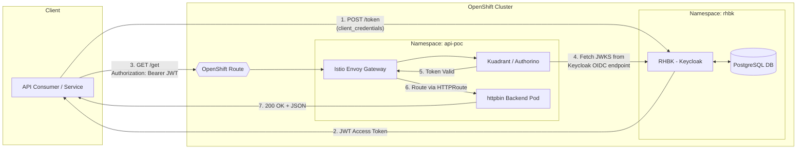

# End-to-End POC: Securing APIs with Red Hat Connectivity Link (RHCL) & Keycloak

## Objective

To secure a Kubernetes Gateway API using JSON Web Tokens (JWT) issued by Red Hat Build of Keycloak (RHBK). The architecture utilizes **OpenShift Service Mesh 3 (Istio)** as the Gateway data plane and **Red Hat Connectivity Link (RHCL)**, powered by Kuadrant, as the policy control plane.

## Architecture Overview



### Request Flow

| Step | Description |
|------|-------------|
| 1 | Client requests a JWT from RHBK using the `client_credentials` grant |
| 2 | RHBK validates credentials and returns a signed JWT |
| 3 | Client sends an HTTP request with the JWT to the external OpenShift Route |
| 4 | Kuadrant (Authorino) intercepts the request, fetches JWKS from Keycloak, and validates the token |
| 5 | If valid, Authorino permits the request |
| 6 | Traffic is routed via HTTPRoute to the httpbin backend pod |
| 7 | Backend responds with `200 OK` and the JSON payload |

## Prerequisites

* An OpenShift cluster with cluster-admin privileges.
* The following Operators installed from OperatorHub:
  - **Red Hat Build of Keycloak**
  - **Red Hat OpenShift Service Mesh 3**
  - **Red Hat Connectivity Link**
* The `oc` CLI and `curl` installed locally.

---

## Step 1: Install Required Operators

Install the following Operators from **OperatorHub**:

1. **Red Hat Build of Keycloak**
2. **Red Hat OpenShift Service Mesh 3**
3. **Red Hat Connectivity Link**

---

## Step 2: Install Kubernetes Gateway API CRDs (OpenShift 4.18 and earlier)

Red Hat Connectivity Link and OpenShift Service Mesh 3 rely entirely on the modern Kubernetes Gateway API standard for routing, rather than the legacy OpenShift Route or Kubernetes Ingress objects.

> **Version Note:**
> - **OpenShift 4.19+:** The Gateway API CRDs are natively installed and managed by the default OpenShift Ingress Operator. You can **skip this step**.
> - **OpenShift 4.18 and older:** The Gateway API CRDs are **not** installed by default. You must install the standard upstream CRDs manually after deploying the operators above.

**1. Apply the upstream standard CRDs:**

Run the following command to pull the official v1.0.0 CRDs from the Kubernetes SIGs repository and apply them to your cluster.

```bash
oc apply -f https://github.com/kubernetes-sigs/gateway-api/releases/download/v1.0.0/standard-install.yaml
```

**2. Verify the installation:**

Wait a few seconds, then confirm that the cluster now recognizes the new Gateway API resource types.

```bash
oc get crd | grep gateway.networking.k8s.io
```

**Expected Output:**

```
gatewayclasses.gateway.networking.k8s.io         2026-05-04T16:00:00Z
gateways.gateway.networking.k8s.io               2026-05-04T16:00:00Z
httproutes.gateway.networking.k8s.io             2026-05-04T16:00:00Z
referencegrants.gateway.networking.k8s.io        2026-05-04T16:00:00Z
```

Once verified, you are ready to deploy RHBK and the Service Mesh control plane.

---

## Step 3: Deploy PostgreSQL Database on OpenShift

RHBK requires a persistent database backend. Deploy a PostgreSQL instance in the same namespace before creating the Keycloak CR.

1. **Create the `rhbk` namespace** (if it doesn't already exist):

```bash
oc new-project rhbk
```

2. **Deploy PostgreSQL** using the following StatefulSet and Service:

```yaml
apiVersion: apps/v1
kind: StatefulSet
metadata:
  name: postgresql-db
  namespace: rhbk
spec:
  serviceName: postgresql-db-service
  selector:
    matchLabels:
      app: postgresql-db
  replicas: 1
  template:
    metadata:
      labels:
        app: postgresql-db
    spec:
      containers:
        - name: postgresql-db
          image: postgres:latest
          volumeMounts:
            - mountPath: /data
              name: cache-volume
          env:
            - name: POSTGRES_PASSWORD
              value: keycloak
            - name: POSTGRES_USER
              value: keycloak
            - name: PGDATA
              value: /data/pgdata
            - name: POSTGRES_DB
              value: keycloak
      volumes:
        - name: cache-volume
          emptyDir: {}
---
apiVersion: v1
kind: Service
metadata:
  name: postgres-db
  namespace: rhbk
spec:
  selector:
    app: postgresql-db
  type: ClusterIP
  ports:
    - port: 5432
      targetPort: 5432
```

3. **Create the database credentials secret** that the Keycloak CR will reference:

```bash
oc create secret generic keycloak-db-secret \
  --from-literal=username=keycloak \
  --from-literal=password=keycloak \
  -n rhbk
```

4. **Verify the database pod is running:**

```bash
oc get pods -n rhbk -l app=postgresql-db
```

---

## Step 4: Deploy RHBK on OpenShift

1. Log into the OpenShift Web Console.
2. Navigate to **OperatorHub**, search for **Red Hat Build of Keycloak**, and install the Operator.
3. Once installed, create a `Keycloak` instance using the following custom resource (CR).
   *(Note: The `additionalOptions` are critical when using OpenShift Edge TLS termination so Keycloak generates HTTPS URLs. The `db` section connects RHBK to the PostgreSQL instance deployed in Step 3.)*

```yaml
apiVersion: k8s.keycloak.org/v2alpha1
kind: Keycloak
metadata:
  name: rhbk-poc
  namespace: rhbk
spec:
  instances: 1
  db:
    vendor: postgres
    host: postgres-db
    usernameSecret:
      name: keycloak-db-secret
      key: username
    passwordSecret:
      name: keycloak-db-secret
      key: password
  hostname:
    hostname: <YOUR_OPENSHIFT_ROUTE_URL>  # e.g., keycloak-rhbk.apps.mycluster.com
    strict: true
  http:
    httpEnabled: true
  ingress:
    className: openshift-default
    enabled: true
  additionalOptions:
    - name: proxy
      value: edge
    - name: proxy-headers
      value: xforwarded
    - name: hostname-url
      value: https://<YOUR_OPENSHIFT_ROUTE_URL>
```

4. **Enable HTTPS (Edge Termination):** In OpenShift, go to **Networking > Routes**, edit the Keycloak route, check **"Secure Route"**, and set TLS Termination to **Edge**.

5. **Get Admin Credentials:** Run `oc extract secret/rhbk-poc-initial-admin --to=-` to retrieve your Keycloak admin password.

---

## Step 5: Configure Keycloak

Log into the Keycloak Admin Console using the HTTPS URL and admin credentials.

1. **Create a new Realm:** `rhcl-poc-realm`
2. **Create a new Client:** `rhcl-api-client`
   - Under **Client Settings**, toggle **Client authentication** to **ON**.
   - Under **Authentication flow**, check **Service accounts roles** (enables machine-to-machine tokens).
3. Go to the **Credentials** tab and copy your **Client Secret**.

---

## Step 6: Initialize the Service Mesh & Kuadrant Control Planes

Create the namespaces required by the Service Mesh 3 (Istio) architecture:

```bash
oc create namespace istio-system
oc create namespace istio-cni
```

Deploy the Istio Control Plane, the CNI plugin, and the Kuadrant Policy Engine:

```yaml
cat <<EOF | oc apply -f -
apiVersion: sailoperator.io/v1
kind: Istio
metadata:
  name: default
spec:
  namespace: istio-system
---
apiVersion: sailoperator.io/v1
kind: IstioCNI
metadata:
  name: default
spec:
  namespace: istio-cni
---
apiVersion: kuadrant.io/v1beta1
kind: Kuadrant
metadata:
  name: kuadrant
  namespace: kuadrant-system
spec: {}
EOF
```

Wait ~60 seconds to ensure the `istiod` and `authorino` pods are running in their respective namespaces.

---

## Step 7: Deploy the Target Application

Create a project for your API and deploy the backend.

> **Note:** We use `go-httpbin` on port 8080 because OpenShift SCC prevents containers from binding to port 80.

```bash
oc new-project api-poc
```

```yaml
cat <<EOF | oc apply -f -
apiVersion: apps/v1
kind: Deployment
metadata:
  name: httpbin
  namespace: api-poc
spec:
  replicas: 1
  selector:
    matchLabels:
      app: httpbin
  template:
    metadata:
      labels:
        app: httpbin
    spec:
      containers:
      - name: httpbin
        image: mccutchen/go-httpbin
        ports:
        - containerPort: 8080
---
apiVersion: v1
kind: Service
metadata:
  name: httpbin
  namespace: api-poc
spec:
  ports:
  - port: 8080
    targetPort: 8080
  selector:
    app: httpbin
EOF
```

---

## Step 8: Configure the Gateway and Routing

Create the Kubernetes Gateway and HTTPRoute.

> **Note:** In OpenShift Sandbox environments, physical LoadBalancers are unavailable. We use the `ClusterIP` annotation to force an internal proxy, and then expose it manually.

```yaml
cat <<EOF | oc apply -f -
apiVersion: gateway.networking.k8s.io/v1
kind: Gateway
metadata:
  name: poc-gateway
  namespace: api-poc
  annotations:
    networking.istio.io/service-type: "ClusterIP"
spec:
  gatewayClassName: istio
  listeners:
  - name: http
    port: 80
    protocol: HTTP
    allowedRoutes:
      namespaces:
        from: Same
---
apiVersion: gateway.networking.k8s.io/v1
kind: HTTPRoute
metadata:
  name: httpbin-route
  namespace: api-poc
spec:
  parentRefs:
  - name: poc-gateway
  hostnames:
  - "api-poc.<YOUR_OPENSHIFT_DOMAIN>"
  rules:
  - matches:
    - path:
        type: PathPrefix
        value: /get
    backendRefs:
    - name: httpbin
      port: 8080
EOF
```

> Replace `<YOUR_OPENSHIFT_DOMAIN>` with your cluster's apps domain (e.g., `apps.ocp.n4z5m.sandbox1285.opentlc.com`).

**Expose the Gateway to the Public Internet:**

Force OpenShift to route external traffic specifically to port 80 of the Istio Gateway service:

```bash
oc expose svc poc-gateway-istio --hostname=api-poc.<YOUR_OPENSHIFT_DOMAIN> --port=80 -n api-poc
```

---

## Step 9: Secure the API with Kuadrant AuthPolicy

Attach a policy to the HTTPRoute instructing Kuadrant to reject any request that lacks a valid token from Keycloak:

```yaml
cat <<EOF | oc apply -f -
apiVersion: kuadrant.io/v1
kind: AuthPolicy
metadata:
  name: require-rhbk-jwt
  namespace: api-poc
spec:
  targetRef:
    group: gateway.networking.k8s.io
    kind: HTTPRoute
    name: httpbin-route
  rules:
    authentication:
      "keycloak-jwt":
        jwt:
          issuerUrl: "https://<YOUR_KEYCLOAK_URL>/realms/rhcl-poc-realm"
EOF
```

> Replace `<YOUR_KEYCLOAK_URL>` with your Keycloak route hostname.

---

## Step 10: End-to-End Validation

### Test 1: Verify the API is Locked

```bash
curl -i http://api-poc.<YOUR_OPENSHIFT_DOMAIN>/get
```

**Expected Result:** `HTTP/1.1 401 Unauthorized` with `x-ext-auth-reason: credential not found`.

### Test 2: Retrieve Access Token from Keycloak

```bash
curl -s -X POST 'https://<YOUR_KEYCLOAK_URL>/realms/rhcl-poc-realm/protocol/openid-connect/token' \
  -H "Content-Type: application/x-www-form-urlencoded" \
  -d "client_id=rhcl-api-client" \
  -d "client_secret=<YOUR_CLIENT_SECRET>" \
  -d "grant_type=client_credentials"
```

Copy the `access_token` string from the JSON response.

### Test 3: Access the API Successfully

```bash
curl -i -H "Authorization: Bearer <PASTE_YOUR_ACCESS_TOKEN_HERE>" \
  http://api-poc.<YOUR_OPENSHIFT_DOMAIN>/get
```

**Expected Result:** `HTTP/1.1 200 OK` alongside the backend JSON payload, confirming Kuadrant successfully validated the Keycloak signature and permitted the request.

---

## Implementation Notes for Production

- **Token Automation:** In production, services should use standard OAuth2 libraries to automatically cache, inject, and refresh tokens.
- **Databases:** This POC reuses an existing PostgreSQL instance. For production, use a PersistentVolumeClaim (PVC) or managed database service for data durability.
- **TLS:** In production, configure TLS on the Gateway listener for end-to-end encryption.
- **Rate Limiting:** Kuadrant also supports `RateLimitPolicy` to further protect your APIs beyond authentication.
